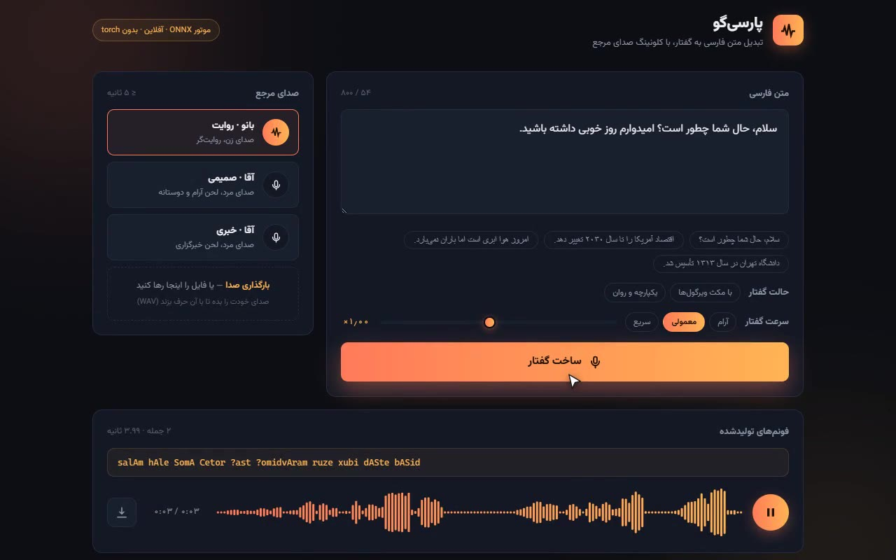
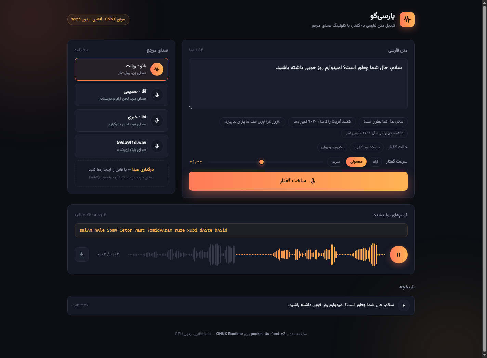

<div align="center">


**Persian** | [English](README.en.md)

<a href="https://github.com/user-attachments/assets/dfc735c3-65fb-473a-a437-747efd8ede20"></a>

https://github.com/user-attachments/assets/dfc735c3-65fb-473a-a437-747efd8ede20

🎬 **70-second video demo (with audio)** — picking a reference voice,
synthesising a sample sentence, uploading a 5-second voice clip and cloning it onto a long paragraph.
(downloadable copy in the repo: [docs/demo.mp4](docs/demo.mp4) — poster:
[docs/demo-poster.jpg](docs/demo-poster.jpg))

</div>

# ParSiGo — Persian Text-to-Speech (pocket-tts-farsi-v2)

Persian text-to-speech with **voice cloning**, fully offline on **CPU** — no GPU, no internet connection at runtime. It takes Persian text directly, performs phonemisation and synthesis itself, and outputs WAV at a 24 kHz sample rate.

It has two execution paths:

- **Pure ONNX Runtime engine** (`scripts/tts_onnx.py` + `scripts/server.py`) — no torch; installed dependencies are ~200MB on Windows (versus ~1.2GB with torch), same speed as the main engine.
- **Main torch path** (`scripts/tts.py`) — the reference pocket-tts pipeline; for development and validation.

Web demo: `./env/Scripts/python.exe scripts/server.py` → http://127.0.0.1:8000
(host/port overridable via the `PARSIGO_HOST`/`PARSIGO_PORT` environment variables)

- 🎧 **Audio sample (no install needed):** [Online demo](https://nimaone-persian-tts-onnx.static.hf.space) — listen to three built-in voices online.
- 📦 **Ready ONNX package:** [`Nimaone/pocket-tts-farsi-v2-onnx`](https://huggingface.co/Nimaone/pocket-tts-farsi-v2-onnx) — no need for torch or building the package; download and run directly.

## ONNX Runtime vs PyTorch Path Comparison

Both paths run the **same model** (identical weights from pocket-tts-farsi-v2); they differ in runtime environment, install size, and portability. The ONNX path is the result of an export project whose goal was "runs on any system, no GPU, no internet."

| Criterion | ONNX path (recommended) | PyTorch path (reference) |
|---|---|---|
| Dependencies | onnxruntime (ONNX Runtime), numpy, scipy, soundfile, sentencepiece | torch, transformers, pocket-tts, soundfile |
| Installed dependency size (Windows) | **~200MB** — onnxruntime 46 + numpy 34 + scipy 115 + sentencepiece + soundfile (scipy is only used for resampling reference audio but is unconditionally imported for now) | **~1.2GB** — torch 536 + transformers 112 + pocket-tts (this torch build is the CPU version; default torch install with CUDA is larger) |
| Model package | `model/onnx/` — 469MB: 4 ONNX graphs + `weights.npz` + `decode_state_init.npz` | `model/v2/` 420MB + `model/g2p/` 32MB |
| GPU | **Not required** — only `CPUExecutionProvider` | Not required (CPU version of torch) |
| OS / Architecture | Anything ORT supports: Windows, Linux, macOS on x64 and ARM64 | Windows, Linux, macOS (Python only) |
| Other language use | Yes — ONNX package is standard in C#/.NET, Java, Node.js, and mobile | No (Python only) |
| Internet at runtime | **Not required** | Not required |
| Startup time | Fast (light ORT loading) | Slower (torch + transformers loading) |
| Persian G2P | Pure ONNX: ByT5 tokenizer in pure Python + greedy decoder on host | transformers + beam-5 |
| Synthesis speed (2.8s audio, CPU) | 3283ms | 3423ms |
| Accuracy vs reference | Wave diff **7.5e-4** (inaudible) | — (is the reference itself) |
| Reproduction with seed | Yes — noise sampled on host with numpy | Yes |
| Long text | Sentence segmentation + chunking + automatic pause | Sentence-by-sentence; outputs stitched manually |
| Output quality control | Retry up to 3 attempts, loudness matching, silence compression | Raw model function |
| pocket-tts fork patch | **Not needed** | Required (3 files; see last section of README) |

### Optimizations That Made It Run on Any System

The ONNX path was not just "getting the export" — the initial export on CPU was about 10% **slower** than torch (each step copied a 12.6MB cache) and still required torch. The following changes made it lightweight, portable, and same-speed:

1. **Complete removal of torch at runtime** — export is a one-time operation (done once with torch), after which the entire pipeline runs with ORT. Proof: running the full pipeline with a block on `sys.meta_path` that blocks torch import → succeeded; torch never appeared in `sys.modules`.
2. **Merging three FlowLM graphs into one** — the prompt and gen graphs only differed in `text_emb` length (6 vs 0) and the voice step had an empty `sequence`. With `torch._dynamo.mark_dynamic` on both dimensions, **one graph** covers all three states (technical note: dynamic dimension with size 0 works correctly in ORT).
3. **K/V-only output instead of full cache** — each step returns only the K/V for that step (~50KB) instead of the full KV cache (~12.6MB in FlowLM), and the host scatters it into a persistent cache with numpy. Decoder input/output also reduced from 57 to 27 tensors. The K/V-only graphs are **bit-identical** to the full-cache version (diff = 0).
4. **Random noise on host** — `torch.nn.init.normal_` is not traceable and seed is not portable in ONNX. Noise is sampled in numpy and fed as input to the graph — which, in addition to portability, guarantees exact reproduction with `--seed` on any system.
5. **ByT5 tokenizer in pure Python** — G2P uses ByT5, meaning `id = UTF-8 byte + 3`, with no tokenizer model file. Instead of transformers, it is implemented in a few lines of Python and matches exactly.
6. **Greedy decoder instead of beam-5** — the G2P decode loop runs on host (the decoder graph is stateless). On 12 test sentences (numbers, ezafe, proper nouns, compound sentences) the output was **exactly** the same as beam-5 in torch — beam search makes no difference for this model.
7. **ORT settings for CPU** — `ORT_ENABLE_ALL` (maximum graph optimization), `intra_op_num_threads=2` and `inter_op_num_threads=1` to prevent oversubscription when up to 4 chunks are generated in parallel; only `CPUExecutionProvider` means identical behavior on machines without GPU.
8. **Host constants in `weights.npz`** — LUT tables, `speaker_proj`, reference voice BOS vector, and normalization statistics were separated from the graphs so each graph stays lightweight.
9. **Weights in sidecar `.data` files** — `torch.onnx` does not support files over 2GB; float32 weights (~341MB) were kept as sidecar files.

Both paths were **tried and did not work** (recorded so it does not repeat): IOBinding with reattachment at each step was **slower** (82.6ms vs 74.4ms per step), and int8 quantization was not possible due to incomplete shape inference of dynamic slice operations. A hybrid engine (FlowLM in torch + Mimi in ONNX) was 13% faster than torch itself but did not eliminate torch — it was not chosen for the "runs on any system" goal. Full measurement details in [`docs/onnx-optimizations.md`](docs/onnx-optimizations.md).

## Project Structure

```
persian_tts/
├── env/               Python virtual environment (torch, transformers, pocket-tts)
├── model/
│   ├── v2/            Main TTS model (mehdi-hf/pocket-tts-farsi-v2)
│   ├── g2p/           Persian→phoneme G2P model (mehdi-hf/Homo-GE2PE-Persian-HF)
│   └── onnx/          Integrated ONNX package (~480MB) + manifest.json
├── voices/            Reference voices (≤ 5 seconds)
├── output/            Generated WAV files (not in git)
├── uploads/           Uploaded voices via demo (not in git)
├── docs/              Technical docs: ONNX feasibility and optimizations
├── scripts/
│   ├── persian_tts.py Pipeline torch module (load_g2p, phonemise, synthesize)
│   ├── tts.py         torch path CLI
│   ├── tts_onnx.py    ONNX path engine and CLI (no torch)
│   ├── g2p_onnx.py    Pure ONNX G2P (standalone usable)
│   ├── server.py      Web demo server (FastAPI) + API
│   ├── export_unified.py Unified package builder for model/onnx/ (one-time, with torch)
│   ├── test_tts_onnx.py ONNX engine validation and benchmark vs torch
│   └── onnx_dev/      ONNX development scripts (spike/bench; historical)
├── web/index.html     Persian RTL web demo UI
├── README.md          Persian documentation
└── README.en.md       English documentation
```

## Setup from Fresh Clone

### ONNX Path (Recommended — No torch)

The ONNX package is downloaded from HuggingFace; no need for torch or building the package.

**1) Virtual environment and lightweight dependencies (~200MB)**

```bash
python -m venv env
./env/Scripts/python.exe -m pip install onnxruntime numpy scipy soundfile sentencepiece
./env/Scripts/python.exe -m pip install fastapi uvicorn
```

**2) Clone the project and download the ONNX package from HuggingFace**

```bash
git clone https://github.com/nimaone/persian_tts
cd persian_tts
./env/Scripts/python.exe -m pip install -U "huggingface_hub[cli]"
hf download Nimaone/pocket-tts-farsi-v2-onnx --local-dir model/onnx
```

**3) Run**

```bash
./env/Scripts/python.exe scripts/tts_onnx.py "سلام، حال شما چطور است؟"
./env/Scripts/python.exe scripts/server.py   # Web demo: http://127.0.0.1:8000
```

> The `Nimaone/pocket-tts-farsi-v2-onnx` package includes all ONNX graphs, constants, and manifest — the same contents that `scripts/export_unified.py` produces. No need to run torch.

### torch Path (Only for Development and Validation)

Model weights are not in git (~920MB) — these three steps:

**1) Virtual environment and dependencies**

```bash
python -m venv env
./env/Scripts/python.exe -m pip install -r requirements.txt
```

`requirements.txt` has two sections; you can install only the needed one:

- **torch path** (`scripts/tts.py`): `pocket-tts`, `transformers`, `soundfile`
- **ONNX path** (`scripts/tts_onnx.py` and demo): `onnxruntime`, `numpy`, `scipy`, `soundfile`, `sentencepiece` (+ `fastapi`/`uvicorn` for server, `onnx`/`onnxscript` and `pedalboard` only for rebuilding package and speed control)

**2) Download models from HuggingFace** (available, no proxy needed)

```bash
mkdir -p model/v2 model/g2p
B=https://huggingface.co/mehdi-hf/pocket-tts-farsi-v2/resolve/main
for f in model.yaml normalize_fa.py tokenizer_ph.model model.safetensors; do
  curl -L -o "model/v2/$f" "$B/$f"; done
G=https://huggingface.co/mehdi-hf/Homo-GE2PE-Persian-HF/resolve/main
for f in config.json generation_config.json tokenizer_config.json added_tokens.json model.safetensors; do
  curl -L -o "model/g2p/$f" "$G/$f"; done
```

**3) Build unified ONNX package** (one-time need for torch; after that torch is no longer needed)

```bash
./env/Scripts/python.exe scripts/export_unified.py
```

> **Note:** Step 3 requires torch because it exports the graphs from the main model, but the *output* (`model/onnx/`) runs completely without torch. Once the package is built, you can run the ONNX path with the same ~200MB dependencies.

## Web Demo (UI)

```bash
./env/Scripts/python.exe scripts/server.py
```

Then in browser: http://127.0.0.1:8000



### How to Use the Demo

1. Type the desired Persian text in the text box or select one of the built-in samples.
2. Select the built-in reference voice or drop your own WAV/MP3/OGG/FLAC file in the side box.
3. Set the speech mode ("with comma pauses" or "smooth and continuous") and speech speed.
4. Click **Generate Speech**; phonemes, audio duration, and waveform are displayed after generation.
5. Play the output, scrub forward and backward on the waveform, download the WAV, or replay from the last 8 history entries.

- Persian RTL interface with modern dark theme (`web/index.html`) — no internet needed
- Reference voice selection + **upload your own voice** (WAV/MP3/OGG/FLAC; automatically trimmed to 5 seconds, mono, and resampled to 24kHz; minimum 1 second required)
- **Two speech modes**: "with comma pauses" (split — each comma/dash gets its own pause) and "smooth and continuous" (pack — comma phrases merged into longer breaths; period/dash/sentence-end pauses preserved)
- **Speech speed control** 0.7× to 1.35× (limited to 0.6–1.5 on server)
- Generated phonemes display, player with waveform and seek, WAV download, last 8 history entries
- Same ONNX engine without torch — the entire server only needs onnxruntime/numpy/scipy/soundfile

Built-in reference voices:

| File | Demo Name | Description |
|---|---|---|
| `voices/male_hello.wav` | آقا · صمیمی | Male voice, calm and friendly tone |
| `voices/female_narration.wav` | بانو · روایت | Female voice, narrator |
| `voices/male_news.wav` | آقا · خبری | Male voice, news tone |

Demo limit: maximum 800 characters of text per request.

## Command Line Usage

### ONNX Path (Recommended — No torch)

```bash
./env/Scripts/python.exe scripts/tts_onnx.py "متن فارسی" [reference-voice.wav] [output.wav] [--seed N] [--pack]
```

| Argument | Default | Description |
|---|---|---|
| Text | `سلام، حال شما چطور است؟` | Persian text **or** phoneme string (auto-detected) |
| Reference voice | `voices/male_hello.wav` | Reference WAV file (≤ 5 seconds) |
| Output | `output/tts_onnx.wav` | Output file path |
| `--seed N` | Random | For exact reproduction of output |
| `--pack` | Empty | "Smooth and continuous" mode (merge comma phrases) |

Multi-sentence text is automatically sentence-segmented, phonemised, and stitched with appropriate pauses.

### torch Path

Simple sentence with default voice (female), and male news anchor with custom output:

```bash
./env/Scripts/python.exe scripts/tts.py "سلام، حال شما چطور است؟"
./env/Scripts/python.exe scripts/tts.py "متن شما" voices/male_news.wav output/my.wav
```

> The torch path processes text **sentence by sentence** (phonemisation + synthesis each time). For long text, separate sentences yourself and stitch outputs together with ~0.45 seconds of silence — the ONNX path does this automatically.

### In Python Code

```python
import sys; sys.path.insert(0, "scripts")

# ONNX path (without torch)
from tts_onnx import OnnxTts
eng = OnnxTts()                       # seed= for reproduction
audio = eng.synthesize_text("سلام دنیا", "voices/male_hello.wav", mode="pack")
# Or directly on phonemes: eng.synthesize("salAm donyA", voice, pace=1.0)

# torch path
from persian_tts import load_g2p, load_tts, synthesize
g2p = load_g2p(); tts = load_tts()
synthesize("سلام دنیا", "voices/male_hello.wav", "output/x.wav", tts=tts, g2p=g2p)

# G2P only
from g2p_onnx import OnnxG2P
print(OnnxG2P().phonemise("اقتصاد آمریکا"))   # -> "?eqtesAde ?AmrikA"
# keep_ezafe=True keeps the ezafe: "?eqtesAde1 ?AmrikA"
```

## Server API (For Developers)

`scripts/server.py` is a FastAPI with the following endpoints:

| Method | Path | Input | Output |
|---|---|---|---|
| `GET` | `/` | — | Demo page (`web/index.html`) |
| `GET` | `/api/voices` | — | `{voices: [{id, name, desc, builtin}]}` |
| `POST` | `/api/tts` | `{text, voice, pace?, mode?}` | `{id, phonemes, duration, pace, mode, sentences}` |
| `GET` | `/api/audio/{id}` | — | WAV (`audio/wav`) |
| `POST` | `/api/voice/upload` | `multipart/form-data` (field `file`) | `{id, name, seconds}` |

Example:

```bash
curl -X POST localhost:8000/api/tts \
  -H 'Content-Type: application/json' \
  -d '{"text":"سلام، حال شما چطور است؟","voice":"male_hello.wav","mode":"pack"}'
# -> {"id":"a1b2c3d4e5f6","phonemes":"salAm hAle SomA Cetor ?ast","duration":2.41,...}
# Audio:  curl localhost:8000/api/audio/a1b2c3d4e5f6 --output out.wav
```

- `voice` is either a built-in voice name or `upload:NAME.wav` (from `/api/voices`).
- `mode` must be `split` or `pack`; `pace` is limited to 0.6–1.5.
- Uploaded voices are stored in `uploads/voices/` (not in git).

## Important Notes and Troubleshooting

- **Reference voice**: Must be ≤ 5 seconds; longer causes the model to continue its own sentence instead of your text. In the demo and ONNX engine automatic trimming is performed. Voices whose first syllable is much louder than the rest are also automatically corrected (otherwise the model replays each part starting from its first word).
- **Repetition or corrupted output**: The ONNX engine generates each chunk up to 3 times and picks the best (silence, burst-silence, dropped words, abnormal length, mid-sentence pause). If it is still problematic, run again — it is random. For exact reproduction, use `--seed 42`.
- **Phonemes directly**: The model does not understand raw Persian text; always pass through `phonemise()` or `synthesize_text()`. (In the ONNX CLI, passing a phoneme string is also supported.)
- **English words**: Persian text with English words (like "Windows", "network") is automatically converted to Persian script; otherwise they are removed.
- **Long text without punctuation**: G2P runs on windows of ≤ 30 words with cuts on conjunction characters; a whole sentence without punctuation from ~45 words and above will produce repetitive output.

## Audio Quality and Architecture

Since the model is stochastic and sometimes produces corrupted output, the ONNX engine has notable quality control layers (details and numbers in `docs/`):

- **Punctuation-aware phrase planning** — comma 0.16s (short breath), period/dash 0.26s (real pause), sentence end 0.45s; short phrases and light initial verbs are merged so no word is dropped.
- **Chunk packing on word boundaries** — budget of ~18 tokens; boundary correction for ezafe, conjunction, light verbs, and extra letters; one-to-two token chunks that sound bad are merged.
- **Parallel generation** of independent chunks (up to 4 workers) + reference voice cache (LRU, 4 entries).
- **Loudness matching** of sections to mean + peak guard + short fade for seamless output.
- **Compression of extra silences** the model produces between sentences.
- **Validation**: ONNX output waveform vs torch with same noise differs by 7.5e-4 (inaudible) and same speed (RTF ~0.88×; details in `scripts/test_tts_onnx.py`).

## Technical Documentation

- [`docs/onnx-feasibility.md`](docs/onnx-feasibility.md) — ONNX export feasibility study: five model graphs, export obstacles and solutions, per-component numerical results.
- [`docs/onnx-optimizations.md`](docs/onnx-optimizations.md) — implemented optimizations (K/V-only, IOBinding, hybrid engine), measurements, and final integration.

## Credits and Licenses

Model weights are not created by this repository; this project uses models published by others:

| Part | Model / Code | Creator | License |
|---|---|---|---|
| Persian TTS + Voice Cloning | [`mehdi-hf/pocket-tts-farsi-v2`](https://huggingface.co/mehdi-hf/pocket-tts-farsi-v2) | `mallahyari` — code and training pipeline: [`mallahyari/pocket-tts`](https://github.com/mallahyari/pocket-tts) | **CC-BY-NC-4.0** |
| Persian→Phoneme G2P | [`mehdi-hf/Homo-GE2PE-Persian-HF`](https://huggingface.co/mehdi-hf/Homo-GE2PE-Persian-HF) | Backport from [`MahtaFetrat/Homo-GE2PE-Persian`](https://huggingface.co/MahtaFetrat/Homo-GE2PE-Persian) written by **Elnaz Rahmati** and colleagues | MIT © 2025 Elnaz Rahmati |
| Base library and architecture | [`pocket-tts`](https://pypi.org/project/pocket-tts/) version 3.1.0 | [Kyutai](https://kyutai.org) | MIT |

**License Warning — Commercial Use Prohibited:** The TTS model is released under **CC-BY-NC-4.0** (a restriction inherited from the training data) and commercial use of its output is not permitted. For commercial use you must obtain a license from the creator or look for a different model.

**About G2P:** What is in `mehdi-hf/Homo-GE2PE-Persian-HF` is not a new model; the weights are byte-by-byte the same as `MahtaFetrat/Homo-GE2PE-Persian` and the only change is packaging (from_pretrained format without dependency on Parsivar). All model credit goes to the original authors.

The code in this repository (scripts and web interface) is written by this project; the models and base library belong to the above creators.

## Install Note (fork patch)

PyPI version 3.1.0 does not recognize three flags including `capitalize_first_letter`, without which the first word of every chunk is dropped. Three fork files from `mallahyari/pocket-tts` replace files in `env/Lib/site-packages/pocket_tts/`: `utils/config.py`, `models/text_chunking.py`, `models/tts_model.py`. If you set up the environment from scratch, fetch these three files again from `https://cdn.jsdelivr.net/gh/mallahyari/pocket-tts@main/<path>` and replace them. (This patch is only needed for the torch path; the ONNX path does not use the PyPI package.)
